---
layout: ./BlogLayout.astro
title: "Digital Electronics Lab Report"
description: "Arduino and Embedded Systems Laboratory Portfolio"
publishDate: 2026-06-04
---
> Arduino & Embedded Systems Laboratory Portfolio
>
> Experiments covering GPIO, displays, sensors, waveform generation, RTC systems, automation, and embedded software development.


# Building Embedded Systems with Arduino: A Digital Electronics Portfolio

This article documents a series of Arduino-based embedded systems projects completed as part of a Digital Electronics laboratory course. The projects progress from basic GPIO control and display interfacing to automation systems, waveform generation, and real-time monitoring using sensors, communication buses, and peripheral devices.

The objective was not only to implement working hardware but also to understand the engineering principles behind digital logic, interfacing, timing, automation, and real-time embedded software development.

---
# Table of Contents

- [Exp 0](#exp-0)
  - [1. LED Blink](#1-led-blink)
  - [2. 7-Segment Display](#2-7-segment-display)
  - [3. LED Matrix Display](#3-led-matrix-display)

- [Exp 1](#exp-1)
  - [1. Temperature Control System](#1-temperature-control-system)
  - [2. Smart Weather Monitoring and Extreme Temperature Alert System](#2-smart-weather-monitoring-and-extreme-temperature-alert-system)

- [Exp 2](#exp-2)
  - [Calculator](#calculator)

- [Exp 3](#exp-3)
  - [Waveform Generator](#1waveform-generator)

- [Experiment 4 — RTC-Based Smart Monitoring and Automation System](#exp4)

---
# List of Figures

## List of Figures

### Experiment 0 — Digital Output and Display Interfacing

| Figure | Description |
|---------|-------------|
| Fig. 0.1 | LED Blink Circuit Diagram |
| Fig. 0.2 | 7-Segment Display Output |
| Fig. 0.3 | LED Matrix Character Display |

### Experiment 1 — Environmental Monitoring and Automation

| Figure | Description |
|---------|-------------|
| Fig. 1.1 | Temperature Control System — Heating Condition |
| Fig. 1.2 | Temperature Control System — Cooling Condition |
| Fig. 1.3 | Smart Weather Monitor — Hot Weather |
| Fig. 1.4 | Smart Weather Monitor — Cold Weather |
| Fig. 1.5 | Smart Weather Monitor — Extreme Temperature Alert |
| Fig. 1.6 | Smart Weather Monitor — Normal Weather |

### Experiment 2 — Scientific Calculator Using Arduino

| Figure | Description |
|---------|-------------|
| Fig. 2.1 | Calculator Output Screen |
| Fig. 2.2 | History Navigation Interface |
| Fig. 2.3 | Password Lock Screen |
| Fig. 2.4 | Prefix Expression Display |

### Experiment 3 — Multi-Waveform Generator

| Figure | Description |
|---------|-------------|
| Fig. 3.1 | PWM Waveform |
| Fig. 3.2 | Sine Wave Output |
| Fig. 3.3 | Triangle Wave Output |

### Experiment 4 — RTC-Based Smart Monitoring and Automation System

| Figure | Description |
|---------|-------------|
| Fig. 4.1 | Final Integrated RTC Monitoring System |

---

# Experiment 0 — Digital Output and Display Interfacing

## 1. LED Blink

### Objective

To interface an LED with an Arduino board and program it to blink at specific time intervals using digital output pins and delay functions. The experiment demonstrates the basic operation of GPIO (General Purpose Input/Output), use of `pinMode()`, `digitalWrite()`, and timing control using `delay()` in Arduino programming.

---

### Understanding

In this program, the LED connected to digital pin 13 of the Arduino is controlled using software instructions. Inside the `setup()` function, pin 13 is configured as an output pin using `pinMode(13, OUTPUT)`.

The `loop()` function runs continuously. The instruction `digitalWrite(13, HIGH)` turns the LED ON by supplying voltage to the pin, and `delay(1200)` keeps it ON for 1200 milliseconds (1.2 seconds). Then `digitalWrite(13, LOW)` turns the LED OFF, and `delay(1400)` keeps it OFF for 1400 milliseconds (1.4 seconds).

Thus, the LED repeatedly blinks with different ON and OFF durations, demonstrating basic Arduino programming and timing control.

---

### Code

```cpp
void setup() {
  pinMode(13, OUTPUT);
}

void loop() {
  digitalWrite(13, HIGH);
  delay(1200);

  digitalWrite(13, LOW);
  delay(1400);
}
```

---

### Screenshot

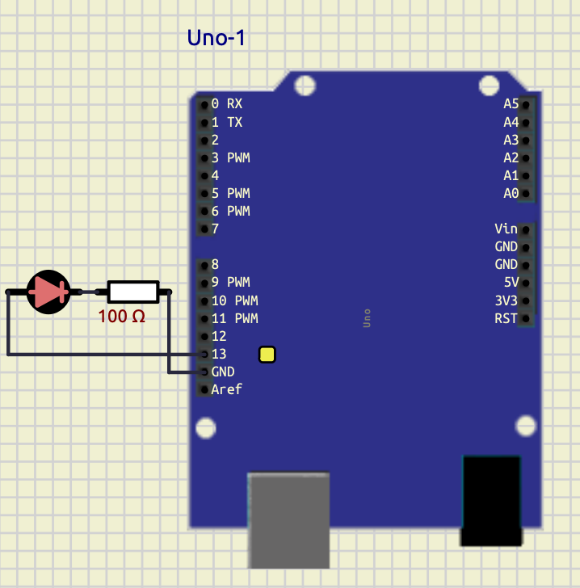

---

### Conclusion

The LED blinking program was successfully implemented using the Arduino board. The experiment demonstrated how to configure a digital pin as an output and control the ON/OFF state of an LED using `digitalWrite()` and `delay()` functions.

The LED blinked continuously with specified timing intervals, verifying the correct operation of the program and providing a basic understanding of Arduino GPIO control and embedded programming concepts.

---

## 2. 7-Segment Display

### Objective

To interface a 7-segment display with an Arduino board and display numerical digits from 0 to 9 using digital output pins. The experiment demonstrates the working principle of seven-segment displays, array-based programming, and digital output control in embedded systems.

---

### Theory

A 7-segment display consists of seven LEDs labeled as `a` to `g`. Different combinations of these segments are turned ON or OFF to display numerical digits.

In this program, the segment pins are stored in the array `segPins[7]`, where each element corresponds to one segment of the display. Another two-dimensional array `digits[10][7]` stores the segment patterns required to display digits from `0` to `9`.

The function `displayDigit(int num)` takes a digit as input and activates the corresponding segments by sending HIGH or LOW signals to the display pins using `digitalWrite()`.

Inside the `loop()` function, a `for` loop continuously counts from `0` to `9`. Each digit is displayed for 1 second using `delay(1000)`.

This experiment demonstrates display interfacing, array handling, function usage, looping structures, and GPIO programming using Arduino.

---

### Code

```cpp
int segPins[7] = {2,3,4,5,6,7,8};

byte digits[10][7] = {
  {1,1,1,1,1,1,0}, //0
  {0,1,1,0,0,0,0}, //1
  {1,1,0,1,1,0,1}, //2
  {1,1,1,1,0,0,1}, //3
  {0,1,1,0,0,1,1}, //4
  {1,0,1,1,0,1,1}, //5
  {1,0,1,1,1,1,1}, //6
  {1,1,1,0,0,0,0}, //7
  {1,1,1,1,1,1,1}, //8
  {1,1,1,1,0,1,1}  //9
};

void displayDigit(int num)
{
  for(int i=0; i<7; i++)
  {
    digitalWrite(segPins[i], digits[num][i]);
  }
}

void setup()
{
  for(int i=0; i<7; i++)
  {
    pinMode(segPins[i], OUTPUT);
  }
}

void loop()
{
  for(int count=0; count<=9; count++)
  {
    displayDigit(count);
    delay(1000);
  }
}
```

---

### Screenshot

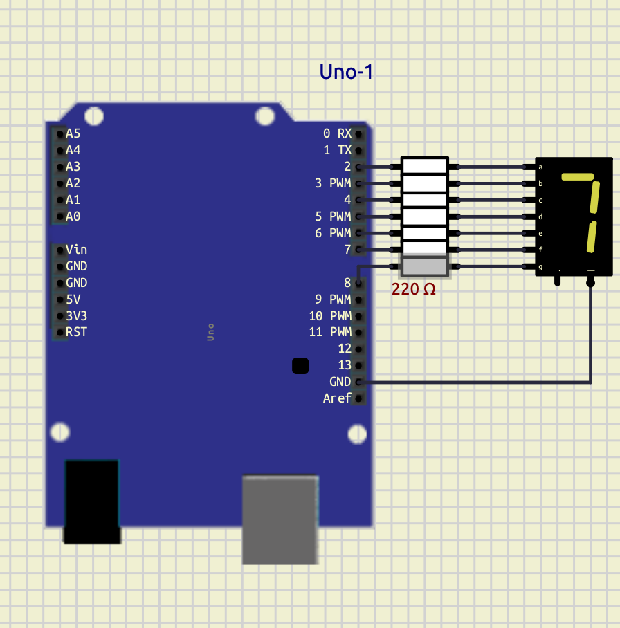

---

### Conclusion

The 7-segment display was successfully interfaced with the Arduino board to display digits from 0 to 9 sequentially. The experiment demonstrated how multiple digital output pins can be controlled using arrays and functions to generate different display patterns.

The program verified the proper operation of GPIO control, looping structures, and display interfacing techniques in embedded systems using Arduino programming.

---

## 3. LED Matrix Display

### Objective

To interface an 8×8 LED matrix display with an Arduino board and display the character `T` using row-column scanning techniques. The experiment demonstrates multiplexing, GPIO control, binary pattern representation, and matrix display interfacing in embedded systems.

---

### theory

An 8×8 LED matrix consists of 64 LEDs arranged in rows and columns. Each LED is controlled by activating a specific row and column simultaneously.

In this program, the row pins are stored in the array `rowPins[8]` and the column pins are stored in `colPins[8]`. The binary pattern representing the letter `T` is stored in the array `T[8]`.

Each binary value corresponds to one row of the matrix:
- `1` represents an LED that should glow.
- `0` represents an LED that should remain OFF.

Inside the `loop()` function, the program scans each row one at a time. First, all rows are turned OFF. Then the required column pattern is applied using `digitalWrite()` and `bitRead()` functions. Finally, the selected row is activated for a very short duration using `delay(2)`.

This rapid scanning process occurs continuously, creating the illusion of a stable character display due to persistence of vision.

The experiment demonstrates matrix multiplexing, binary data representation, row-column addressing, and display interfacing using Arduino.

---

### Code

```cpp
int rowPins[8] = {2,3,4,5,6,7,8,9};
int colPins[8] = {10,11,12,13,A3,A2,A1,A0};

// Letter T
byte T[8] = {
  B11111111,
  B00011000,
  B00011000,
  B00011000,
  B00011000,
  B00011000,
  B00011000,
  B00011000
};

void setup()
{
  for(int i=0; i<8; i++)
  {
    pinMode(rowPins[i], OUTPUT);
    pinMode(colPins[i], OUTPUT);
  }
}

void loop()
{
  for(int row=0; row<8; row++)
  {
    for(int i=0; i<8; i++)
    {
      digitalWrite(rowPins[i], LOW);
    }

    for(int col=0; col<8; col++)
    {
      if(bitRead(T[row], 7-col))
      {
        digitalWrite(colPins[col], LOW);
      }
      else
      {
        digitalWrite(colPins[col], HIGH);
      }
    }

    digitalWrite(rowPins[row], HIGH);

    delay(2);
  }
}
```

---

### Screenshot


---

### Conclusion

The 8×8 LED matrix display was successfully interfaced with the Arduino board to display the character `T`. The experiment demonstrated how row-column scanning and multiplexing techniques are used to control multiple LEDs efficiently using limited GPIO pins.

The program verified the working of binary pattern mapping, bit manipulation, and dynamic display refreshing in embedded systems using Arduino programming.


# Experiment 1 — Environmental Monitoring and Automation

## 1. Temperature Control System

---

### Objective

To interface a temperature sensor with an Arduino board and implement an automatic temperature control system using LEDs and a DC motor. The experiment demonstrates sensor interfacing, conditional control, digital output operation, and automation using Arduino programming.

---
### Components Required

- Arduino Uno
- DHT22 Temperature Sensor
- LEDs
- 220Ω Resistors
- DC Motor
- Connecting Wires
---
### Theory

Temperature monitoring and control systems are widely used in embedded systems and industrial automation. In this experiment, the DHT22 digital temperature sensor is interfaced with the Arduino Uno to continuously monitor environmental temperature.

The Arduino reads temperature data from the sensor and performs different actions depending on the temperature range:

- If temperature exceeds `35°C`:
  - Warning LED turns ON
  - Cooling fan (DC motor) turns ON

- If temperature falls below `25°C`:
  - Heater indicator LED turns ON

- If temperature remains between `25°C` and `35°C`:
  - All outputs remain OFF

The experiment demonstrates:
- Digital sensor interfacing
- GPIO control
- Embedded automation
- Conditional programming using `if-else`
- Temperature-based decision making
---
### Circuit Connections

| Component       | Arduino Pin |
| --------------- | ----------- |
| DHT22 Output    | D2          |
| Warning LED     | D3          |
| Heater LED      | D5          |
| Relay           | D8          |
| GND Connections | GND         |

| Component | Connection   |
| --------- | ------------ |
| Relay     | Power Supply |
| Fan       | Relay        |

---
### Arduino Code

```cpp
#include <DHT.h>

#define DHTPIN 2
#define DHTTYPE DHT22

DHT dht(DHTPIN, DHTTYPE);

void setup() {

  Serial.begin(9600);

  dht.begin();

  pinMode(3, OUTPUT);
  pinMode(5, OUTPUT);
  pinMode(8, OUTPUT);
}

void loop() {

  float temp = dht.readTemperature();

  Serial.println(temp);

  if (isnan(temp)) {

    digitalWrite(3, LOW);
    digitalWrite(5, LOW);
    digitalWrite(8, LOW);

    return;
  }

  // HOT CONDITION
  if(temp > 35) {

    digitalWrite(3, HIGH);
    digitalWrite(8, HIGH);
    digitalWrite(5, LOW);
  }

  // COLD CONDITION
  else if(temp < 25) {

    digitalWrite(5, HIGH);
    digitalWrite(3, LOW);
    digitalWrite(8, LOW);
  }

  // NORMAL CONDITION
  else {

    digitalWrite(3, LOW);
    digitalWrite(5, LOW);
    digitalWrite(8, LOW);
  }

  delay(1000);
}
````

---
### **Screenshots**

#### **Heating Condition**

When temperature falls below `25°C`, the heater indicator LED turns ON.
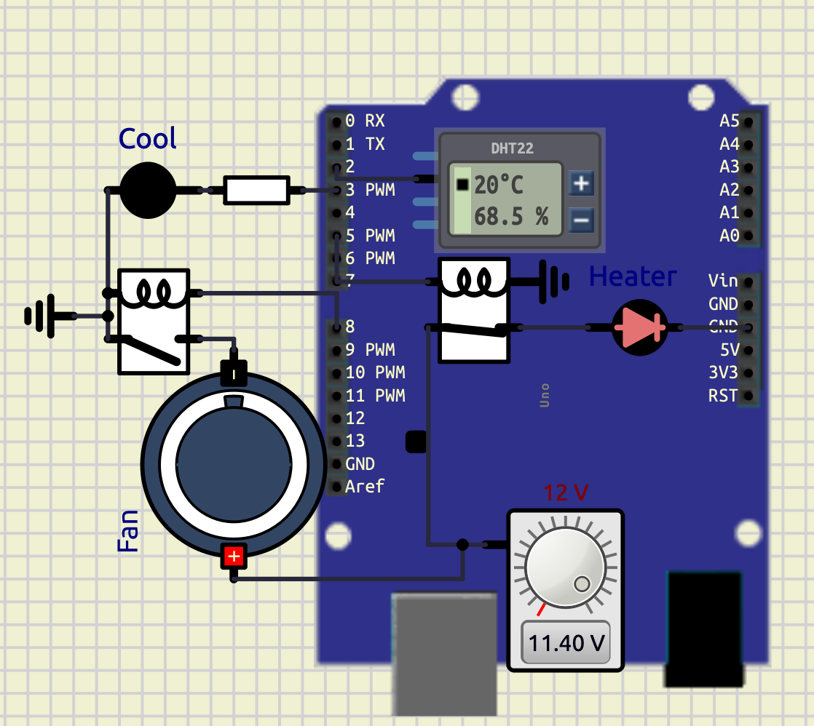

#### **Cooling Condition**

When temperature rises above `35°C`, the warning LED and cooling fan turn ON.

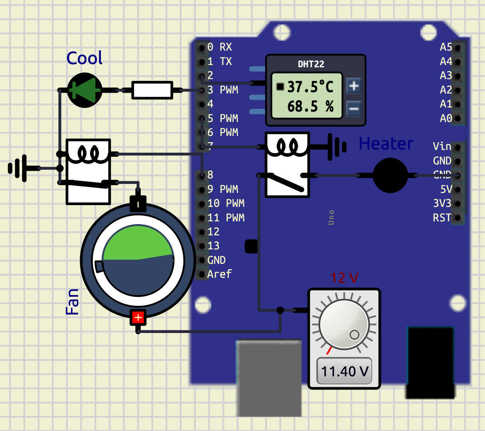

---
### **Observations**

| **Temperature Range** | **Output Condition**   |
| --------------------- | ---------------------- |
| Below 25°C            | Heater LED ON          |
| 25°C – 35°C           | All Outputs OFF        |
| Above 35°C            | Warning LED and Fan ON |

---

### **Conclusion**

The experiment successfully demonstrated temperature sensing and automatic control using Arduino. The DHT22 sensor accurately measured temperature, and the Arduino performed appropriate control actions using conditional logic.

The experiment verified practical concepts of:

- Sensor interfacing
- Embedded control systems
- GPIO operation
- Automation techniques
- Real-time monitoring systems

The system can be further expanded for industrial temperature monitoring, smart home automation, and environmental control applications

## 2. Smart Weather Monitoring and Extreme Temperature Alert System

---
### Objective

To design and implement a smart weather monitoring system using Arduino Uno, DHT22 sensor, LCD display, LEDs, DC motor, and buzzer. The system continuously monitors temperature and humidity conditions and displays different weather states such as normal weather, hot weather, cold weather, heat wave, and extreme temperature alerts.

---
### Components Required

- Arduino Uno
- DHT22 Temperature and Humidity Sensor
- 16×2 LCD Display (HD44780)
- LEDs
- 220Ω Resistors
- DC Motor / Fan
- Audio Output / Buzzer
- Connecting Wires
- Relay
---
### Theory

Smart weather monitoring systems are widely used in embedded systems, environmental monitoring, industrial automation, and safety systems. In this experiment, the DHT22 sensor continuously measures environmental temperature and humidity and sends the data digitally to the Arduino Uno.

The Arduino processes the sensor values and displays different weather conditions on a 16×2 LCD display. Depending on temperature and humidity conditions, LEDs, cooling fan, and alarm systems are activated automatically.

The system works according to the following conditions:

- `Temperature > 45°C`
  - Extreme Temperature Alert
  - Buzzer ON
  - Cooling Fan ON
  - Warning LED ON

- `Temperature > 40°C and Humidity < 30%`
  - Heat Wave Detection

- `Temperature > 35°C`
  - Hot Weather Condition

- `Temperature < 15°C`
  - Cold Weather Condition

- `Humidity > 80%`
  - Rain Possibility Detection

- Otherwise:
  - Normal Weather Condition

---
### Circuit Connections

| Component             | Arduino Pin  |
| --------------------- | ------------ |
| DHT22 Output          | D2           |
| Warning LED           | D3           |
| Heater LED            | D5           |
| Relay                 | D8           |
| Buzzer / Audio Output | D9           |
| LCD RS                | A0           |
| LCD EN                | A1           |
| LCD D4                | A2           |
| LCD D5                | A3           |
| LCD D6                | A4           |
| LCD D7                | A5           |

| Component | Connection   |
| --------- | ------------ |
| Relay     | Power Supply |
| Fan       | Relay        |


---
### Arduino Code

```cpp
#include <DHT.h>
#include <LiquidCrystal.h>

LiquidCrystal lcd(A0, A1, A2, A3, A4, A5);

#define DHTPIN 2
#define DHTTYPE DHT22

DHT t(DHTPIN, DHTTYPE);

void setup() {

  Serial.begin(9600);

  t.begin();

  lcd.begin(16,2);

  pinMode(3, OUTPUT);
  pinMode(5, OUTPUT);
  pinMode(8, OUTPUT);
  pinMode(9, OUTPUT);
}

void loop() {

  float temp = t.readTemperature();
  float humid = t.readHumidity();

  Serial.print("Temperature: ");
  Serial.println(temp);

  Serial.print("Humidity: ");
  Serial.println(humid);

  if(isnan(temp) || isnan(humid)) {

    digitalWrite(3, LOW);
    digitalWrite(5, LOW);
    digitalWrite(8, LOW);

    noTone(9);

    lcd.clear();

    lcd.setCursor(0,0);
    lcd.print("SENSOR ERROR");

    delay(1000);

    return;
  }

  if(temp > 45) {

    tone(9,1000);

    digitalWrite(3, HIGH);
    digitalWrite(8, HIGH);
    digitalWrite(5, LOW);

    lcd.clear();

    lcd.setCursor(0,0);
    lcd.print("EXTREME TEMP");

    lcd.setCursor(0,1);
    lcd.print("ALERT");
  }

  else if(temp > 40 && humid < 30) {

    noTone(9);

    digitalWrite(3, HIGH);
    digitalWrite(8, HIGH);
    digitalWrite(5, LOW);

    lcd.clear();

    lcd.setCursor(0,0);
    lcd.print("HEAT WAVE");

    lcd.setCursor(0,1);
    lcd.print("DRY WEATHER");
  }

  else if(temp > 35) {

    noTone(9);

    digitalWrite(3, HIGH);
    digitalWrite(8, HIGH);
    digitalWrite(5, LOW);

    lcd.clear();

    lcd.setCursor(0,0);
    lcd.print("HOT WEATHER");

    lcd.setCursor(0,1);
    lcd.print("TEMP HIGH");
  }

  else if(temp < 15) {

    noTone(9);

    digitalWrite(3, LOW);
    digitalWrite(8, LOW);
    digitalWrite(5, HIGH);

    lcd.clear();

    lcd.setCursor(0,0);
    lcd.print("COLD WEATHER");

    lcd.setCursor(0,1);
    lcd.print("TEMP LOW");
  }

  else if(humid > 80) {

    noTone(9);

    digitalWrite(3, LOW);
    digitalWrite(5, LOW);
    digitalWrite(8, LOW);

    lcd.clear();

    lcd.setCursor(0,0);
    lcd.print("RAIN");

    lcd.setCursor(0,1);
    lcd.print("POSSIBILITY");
  }

  else {

    noTone(9);

    digitalWrite(3, LOW);
    digitalWrite(5, LOW);
    digitalWrite(8, LOW);

    lcd.clear();

    lcd.setCursor(0,0);
    lcd.print("NORMAL");

    lcd.setCursor(0,1);
    lcd.print("WEATHER");
  }

  delay(1000);
}
````
---
### **Screenshots**

#### **Hot Weather Condition**

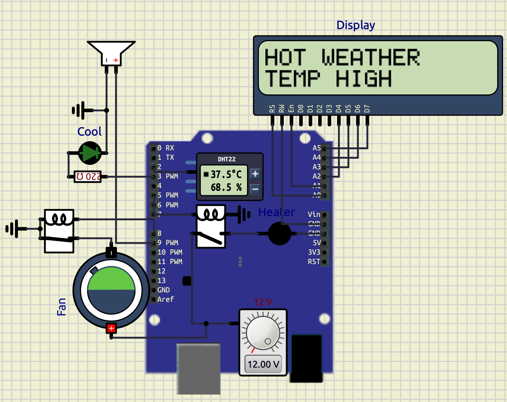

When the temperature exceeds `35°C`, the warning LED and cooling fan turn ON, and the LCD displays **“HOT WEATHER”**.

---

#### **Cold Weather Condition**

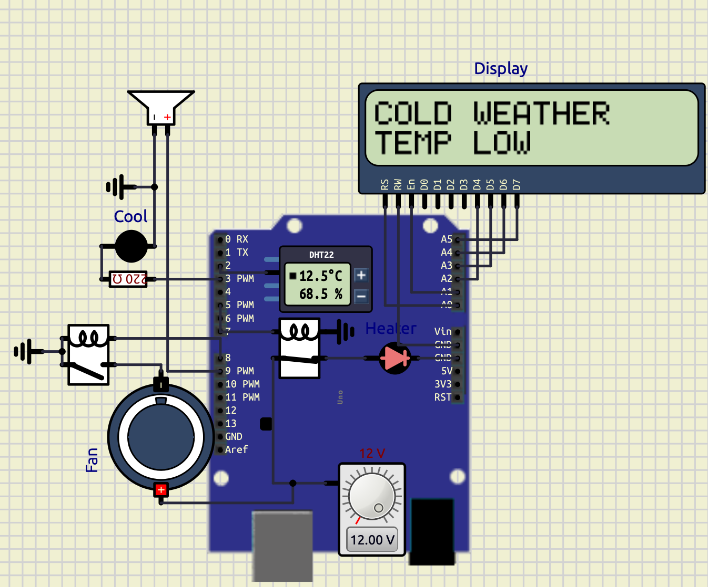

When the temperature falls below `15°C`, the heater indicator LED turns ON and the LCD displays **“COLD WEATHER”**.

---

#### **Extreme Temperature Alert**

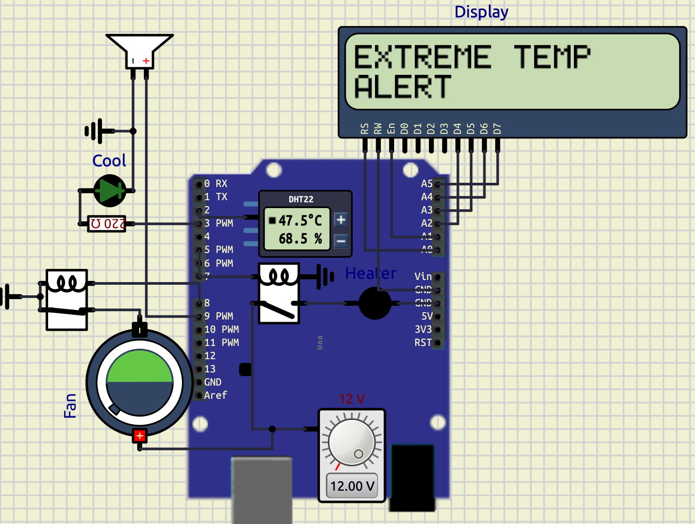

When the temperature exceeds `45°C`, the buzzer activates along with the warning LED and cooling fan, and the LCD displays **“EXTREME TEMP ALERT”**.

---

#### **Normal Weather Condition**

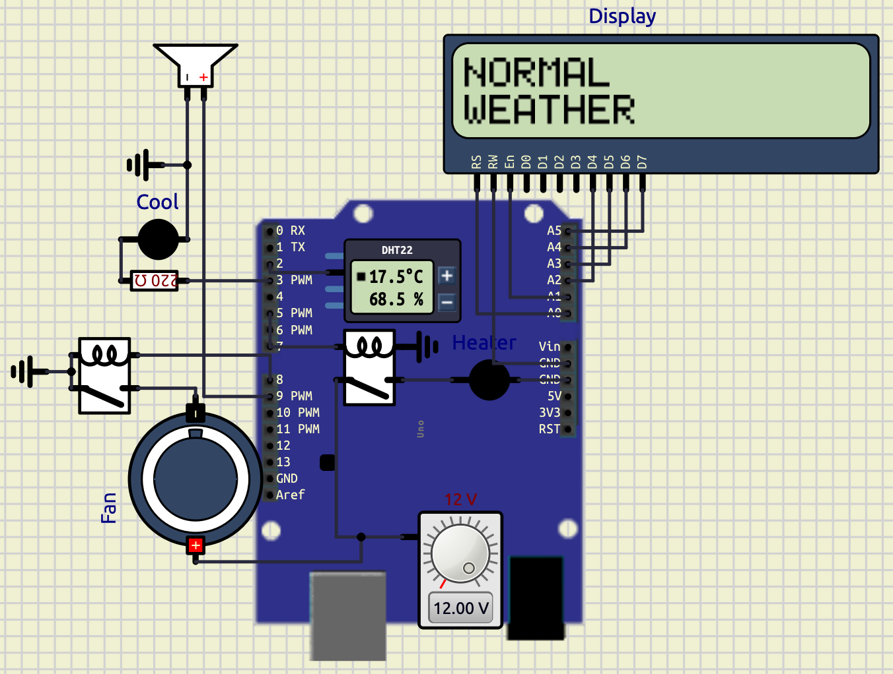

When the temperature and humidity remain within the normal range, all indicators remain OFF and the LCD displays **“NORMAL WEATHER”**.

*Extreme temperatures and rain possibility is not shown.*

---
### **Observations**

| **Weather Condition**                 | **Output Response**                   |
| ------------------------------------- | ------------------------------------- |
| Temperature < 15°C                    | Heater LED ON                         |
| 15°C – 35°C                           | Normal Weather                        |
| Temperature > 35°C                    | Warning LED + Cooling Fan ON          |
| Temperature > 45°C                    | Warning LED + Cooling Fan + Buzzer ON |
| Humidity > 80%                        | Rain Possibility Detection            |
| Temperature > 40°C and Humidity < 30% | Heat Wave Detection                   |

---
### **Conclusion**

The experiment successfully demonstrated a smart weather monitoring and alert system using Arduino and DHT22 sensor interfacing. The system continuously monitored temperature and humidity and automatically generated warnings and alerts based on environmental conditions.

The experiment verified:

- Sensor interfacing
- LCD interfacing
- Real-time environmental monitoring
- Alarm systems
- Embedded automation
- Weather condition detection
- Conditional control systems

The project can be further extended into smart weather stations, industrial environmental monitoring systems, smart home automation, and disaster warning systems.
# Experiment 2 — Scientific Calculator Using Arduino
## **Calculator**

### **Objective**

The objective of this project is to design and implement a compact scientific calculator using Arduino UNO, PCD8544 graphical LCD, and a matrix keypad. The calculator supports arithmetic operations, infix-to-prefix conversion, prefix evaluation, history storage, expression editing, and password protection.

---

## **Components Used**

|**Component**|**Quantity**|**Purpose**|
|---|---|---|
|Arduino UNO|1|Main controller|
|PCD8544 Nokia 5110 LCD|1|Display|
|5×6 Matrix Keypad|1|User input|
|Jumper Wires|Multiple|Connections|
|USB Cable|1|Programming and power|

---

## **Arduino Code Libraries Used**

The following Arduino libraries were used in the program:

|**Library**|**Purpose**|
|---|---|
|`Adafruit_GFX.h`|Graphics handling|
|`Adafruit_PCD8544.h`|Nokia 5110 LCD control|
|`Keypad.h`|Matrix keypad scanning|
|`math.h`|Mathematical operations|
|`string.h`|Character array handling|
|`stdlib.h`|Numeric conversions|

---

## **Circuit Connections**

### **PCD8544 LCD Connections**

|**LCD Pin**|**Arduino UNO Pin**|
|---|---|
|RST|A0|
|CE / CS|A1|
|DC|A2|
|DIN|A3|
|CLK|A4|
|VCC|3.3V|
|LIGHT|3.3V|
|GND|GND|

---

### **Keypad Connections**

### **Row Pins**

|**Keypad Row**|**Arduino Pin**|
|---|---|
|R1|D2|
|R2|D3|
|R3|D4|
|R4|D5|
|R5|D6|
|R6|D7|

### **Column Pins**

|**Keypad Column**|**Arduino Pin**|
|---|---|
|C1|D8|
|C2|D9|
|C3|D10|
|C4|D11|
|C5|D12|

---

## **Working Principle**

The calculator accepts expressions in infix form such as:

```text
86*55-(9/4)
```

The processing flow is:

```text
INFIX
   ↓
INFIX TO PREFIX
   ↓
PREFIX EVALUATION
   ↓
RESULT DISPLAY
```

The expression is first converted into prefix notation and then evaluated using stack-based processing.

---

### **Why Prefix Conversion Was Used**

The prefix conversion mechanism was implemented to demonstrate compiler-design concepts and stack-based expression evaluation.

Advantages:

- Better understanding of operator precedence
- Structured parsing method
- Simplified evaluation logic
- Educational demonstration of expression conversion

Example:

### **Infix Expression**

```text
7+8*2
```

### **Prefix Expression**

```text
+7*82
```

The calculator internally evaluates the converted prefix expression.

---

### **Prefix Evaluation Method**

The prefix expression is evaluated from:

```text
Right → Left
```

Algorithm:

1. Read symbol
2. If operand:
    - push to stack
3. If operator:
    - pop two operands
    - apply operation
    - push result back

---

### **Mathematical Functions Supported**

|**Function**|**Symbol**|
|---|---|
|Addition|`+`|
|Subtraction|`-`|
|Multiplication|`*`|
|Division|`/`|
|Power|`^`|
|Square Root|`R`|
|Percentage|`%`|
|Parentheses|`( ) { }`|

---

### **Cursor Navigation**

The calculator supports cursor-based editing.

|**Key**|**Operation**|
|---|---|
|`<`|Move cursor left|
|`>`|Move cursor right|
|`B`|Delete previous character|

This allows insertion and modification of expressions at arbitrary positions.

---

### **History Function**

The calculator stores previously entered expressions.

### **Features**

- Stores last 5 expressions
- Navigation through history
- Expression recall and reuse

### **Controls**

|**Key**|**Function**|
|---|---|
|`H`|Enter history mode|
|`<`|Previous expression|
|`>`|Next expression|
|`=`|Reload selected expression|
|`C`|Exit history mode|

---

### **Lock Function**

A password-protection system was implemented to restrict calculator access.

### **Password**

```text
123
```

### **Working**

When the user presses:

```text
L
```

the calculator enters lock mode.

  

Display shows:

```text
ENTER PSWD
```

### **Correct Password**

If password entered is:

```text
123
```

the calculator unlocks successfully.

### **Incorrect Password**

For invalid password:

```text
INVALID
```

is displayed and the calculator remains locked.

---
## **Arduino Program Structure**

Main program modules:

| **Function**       | **Purpose**                 |
| ------------------ | --------------------------- |
| `renderDisplay()`  | Updates LCD                 |
| `insertChar()`     | Inserts characters          |
| `backspace()`      | Deletes characters          |
| `infixToPrefix()`  | Converts expressions        |
| `evaluatePrefix()` | Evaluates prefix expression |
| `saveHistory()`    | Stores history              |
| `showHistory()`    | Displays history            |
| `loadHistory()`    | Recalls history             |
| `showMessage()`    | Displays notifications      |
## Code

```cpp
// ======================================================
// LIBRARIES
// ======================================================
#include <Adafruit_GFX.h>
#include <Adafruit_PCD8544.h>
#include <Keypad.h>
#include <math.h>
#include <string.h>
#include <stdlib.h>

// ======================================================
// DISPLAY VARIABLES
// ======================================================
Adafruit_PCD8544 display(A4,A3,A2,A1,A0);

// ======================================================
// EXPRESSION VARIABLES
// ======================================================
char expr[31]="";
char prefixExpr[31]="";
char tempExpr[31]="";
int exprLen=0;
int cursorPos=0;
float ans=0;

// ======================================================
// LOCK SYSTEM VARIABLES
// ======================================================
bool locked=false;
char entered[4]="";
int passPos=0;

// ======================================================
// HISTORY VARIABLES
// ======================================================
char history[5][31];
int historyCount=0;
int historyIndex=0;
bool historyMode=false;

// ======================================================
// STACK VARIABLES
// ======================================================
float valueStack[20];
char opStack[20];
int vTop;
int oTop;

// ======================================================
// KEYPAD VARIABLES
// ======================================================
const byte ROWS=6;
const byte COLS=5;
char keys[ROWS][COLS]={
{'1','2','3','+','-'},
{'4','5','6','*','/'},
{'7','8','9','(',')'},
{'C','0','.','=','R'},
{'H','{','}','L','%'},
{'^','<','>','B','A'}
};
byte rowPins[ROWS]={2,3,4,5,6,7};
byte colPins[COLS]={8,9,10,11,12};
Keypad keypad=Keypad(makeKeymap(keys),rowPins,colPins,ROWS,COLS);

// ======================================================
// DISPLAY FUNCTION
// ======================================================
void renderDisplay(){
display.clearDisplay();
display.setTextSize(1);
display.setTextColor(BLACK);
display.setCursor(0,0);
display.println("Calculator");
display.drawLine(0,8,83,8,BLACK);
int start=0;
int visibleChars=14;
if(cursorPos>=visibleChars){
start=cursorPos-visibleChars+1;
}
display.setCursor(0,18);
for(int i=start;i<exprLen&&i<start+visibleChars;i++){
display.print(expr[i]);
}
int localCursor=cursorPos-start;
int cursorX=localCursor*6;
display.drawLine(cursorX,35,cursorX+5,35,BLACK);
display.display();
}

// ======================================================
// MESSAGE DISPLAY FUNCTION
// ======================================================
void showMessage(const char* msg){
display.clearDisplay();
display.setTextSize(1);
display.setCursor(0,20);
display.println(msg);
display.display();
delay(700);
renderDisplay();
}

// ======================================================
// OPERATOR CHECK FUNCTION
// ======================================================
bool isOperator(char c){
return(c=='+'||c=='-'||c=='*'||c=='/'||c=='^');
}

// ======================================================
// OPERATOR PRECEDENCE FUNCTION
// ======================================================
int precedence(char op){
if(op=='+'||op=='-')
return 1;
if(op=='*'||op=='/')
return 2;
if(op=='^')
return 3;
return 0;
}

// ======================================================
// OPERATION EXECUTION FUNCTION
// ======================================================
float applyOp(float a,float b,char op){
switch(op){
case '+':
return a+b;
case '-':
return a-b;
case '*':
return a*b;
case '/':
if(b!=0)
return a/b;
return 0;
case '^':
return pow(a,b);
}
return 0;
}

// ======================================================
// STRING REVERSE FUNCTION
// ======================================================
void reverseString(char src[],char dest[]){
int len=strlen(src);
for(int i=0;i<len;i++){
dest[i]=src[len-1-i];
}
dest[len]='\0';
}

// ======================================================
// INFIX TO PREFIX CONVERSION
// ======================================================
void infixToPrefix(){
reverseString(expr,tempExpr);
for(int i=0;tempExpr[i]!='\0';i++){
if(tempExpr[i]=='(')
tempExpr[i]=')';
else if(tempExpr[i]==')')
tempExpr[i]='(';
else if(tempExpr[i]=='{')
tempExpr[i]='}';
else if(tempExpr[i]=='}')
tempExpr[i]='{';
}
char postfix[31]="";
int p=0;
oTop=-1;
int i=0;
while(tempExpr[i]!='\0'){
if(isDigit(tempExpr[i])||tempExpr[i]=='.'){
postfix[p++]=tempExpr[i];
}
else if(tempExpr[i]=='('||tempExpr[i]=='{'){
opStack[++oTop]=tempExpr[i];
}
else if(tempExpr[i]==')'||tempExpr[i]=='}'){
while(oTop>=0&&opStack[oTop]!='('&&opStack[oTop]!='{'){
postfix[p++]=opStack[oTop--];
}
oTop--;
}
else{
while(oTop>=0&&precedence(opStack[oTop])>precedence(tempExpr[i])){
postfix[p++]=opStack[oTop--];
}
opStack[++oTop]=tempExpr[i];
}
i++;
}
while(oTop>=0){
postfix[p++]=opStack[oTop--];
}
postfix[p]='\0';
reverseString(postfix,prefixExpr);
}

// ======================================================
// PREFIX EVALUATION FUNCTION
// ======================================================
float evaluatePrefix(){
vTop=-1;
int len=strlen(prefixExpr);
for(int i=len-1;i>=0;i--){
if(isDigit(prefixExpr[i])){
float val=prefixExpr[i]-'0';
valueStack[++vTop]=val;
}
else if(isOperator(prefixExpr[i])){
float a=valueStack[vTop--];
float b=valueStack[vTop--];
valueStack[++vTop]=applyOp(a,b,prefixExpr[i]);
}
}
return valueStack[vTop];
}

// ======================================================
// CHARACTER INSERT FUNCTION
// ======================================================
void insertChar(char c){
if(exprLen>=30)
return;
if(cursorPos>0&&isOperator(c)&&isOperator(expr[cursorPos-1])){
return;
}
for(int i=exprLen;i>cursorPos;i--){
expr[i]=expr[i-1];
}
expr[cursorPos]=c;
exprLen++;
cursorPos++;
expr[exprLen]='\0';
}

// ======================================================
// BACKSPACE FUNCTION
// ======================================================
void backspace(){
if(exprLen<=0||cursorPos<=0)
return;
for(int i=cursorPos-1;i<exprLen-1;i++){
expr[i]=expr[i+1];
}
exprLen--;
cursorPos--;
expr[exprLen]='\0';
}

// ======================================================
// CLEAR EXPRESSION FUNCTION
// ======================================================
void clearExpr(){
exprLen=0;
cursorPos=0;
expr[0]='\0';
}

// ======================================================
// SAVE HISTORY FUNCTION
// ======================================================
void saveHistory(){
if(historyCount<5){
strcpy(history[historyCount++],expr);
}
else{
for(int i=1;i<5;i++){
strcpy(history[i-1],history[i]);
}
strcpy(history[4],expr);
}
}

// ======================================================
// SHOW HISTORY FUNCTION
// ======================================================
void showHistory(){
display.clearDisplay();
display.setTextSize(1);
display.setCursor(0,0);
display.println("HISTORY");
display.setCursor(0,20);
display.println(history[historyIndex]);
display.display();
}

// ======================================================
// LOAD HISTORY FUNCTION
// ======================================================
void loadHistory(){
strcpy(expr,history[historyIndex]);
exprLen=strlen(expr);
cursorPos=exprLen;
historyMode=false;
renderDisplay();
}

// ======================================================
// PREFIX DISPLAY FUNCTION
// ======================================================
void showPrefix(){
display.clearDisplay();
display.setTextSize(1);
display.setCursor(0,0);
display.println("PREFIX");
display.setCursor(0,20);
display.println(prefixExpr);
display.display();
delay(1000);
}

// ======================================================
// SETUP FUNCTION
// ======================================================
void setup(){
display.begin();
display.setContrast(60);
clearExpr();
renderDisplay();
}

// ======================================================
// MAIN LOOP FUNCTION
// ======================================================
void loop(){
char key=keypad.getKey();
if(!key)
return;

// ======================================================
// LOCK MODE
// ======================================================
if(locked){
if(isDigit(key)){
if(passPos<3){
entered[passPos++]=key;
entered[passPos]='\0';
}
}
else if(key=='='){
if(strcmp(entered,"123")==0){
locked=false;
passPos=0;
entered[0]='\0';
renderDisplay();
}
else{
passPos=0;
entered[0]='\0';
showMessage("INVALID");
}
}
display.clearDisplay();
display.setCursor(0,0);
display.println("ENTER PSWD");
display.display();
return;
}

// ======================================================
// HISTORY MODE
// ======================================================
if(historyMode){
if(key=='<'){
if(historyIndex>0)
historyIndex--;
}
else if(key=='>'){
if(historyIndex<historyCount-1){
historyIndex++;
}
}
else if(key=='='){
loadHistory();
return;
}
else if(key=='C'){
historyMode=false;
renderDisplay();
return;
}
showHistory();
return;
}

// ======================================================
// NORMAL CALCULATOR MODE
// ======================================================
switch(key){
case 'C':
clearExpr();
break;

case 'B':
backspace();
break;

case '<':
if(cursorPos>0)
cursorPos--;
break;

case '>':
if(cursorPos<exprLen)
cursorPos++;
break;

case 'L':
locked=true;
passPos=0;
entered[0]='\0';
break;

case 'H':
if(historyCount>0){
historyMode=true;
historyIndex=historyCount-1;
showHistory();
}
return;

case 'R':
ans=sqrt(evaluatePrefix());
dtostrf(ans,0,2,expr);
exprLen=strlen(expr);
cursorPos=exprLen;
break;

case '%':
ans=evaluatePrefix()/100.0;
dtostrf(ans,0,2,expr);
exprLen=strlen(expr);
cursorPos=exprLen;
break;

case '=':
if(exprLen==0)
break;
infixToPrefix();
showPrefix();
ans=evaluatePrefix();
saveHistory();
dtostrf(ans,0,2,expr);
exprLen=strlen(expr);
cursorPos=exprLen;
break;

default:
insertChar(key);
}
renderDisplay();
}
```

---

## **Screenshots**

### **1. Calculator Output**

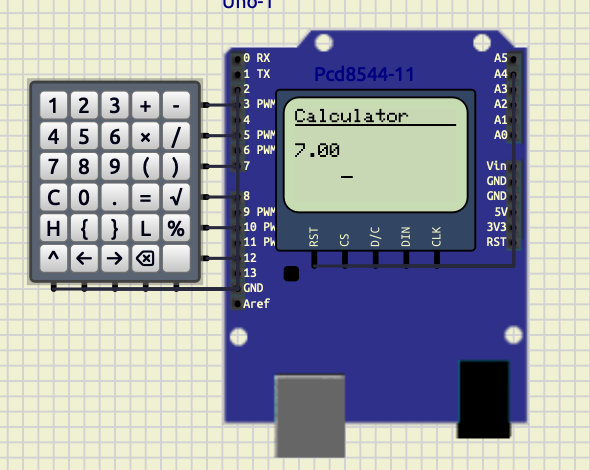

Description:  
This screenshot shows successful arithmetic evaluation and result display on the PCD8544 LCD.

---

### **2. History Navigation**

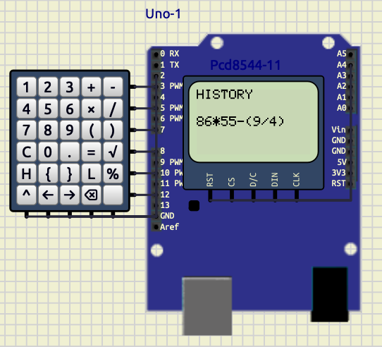

Description:  
This screenshot demonstrates the history system where previously entered expressions can be navigated and reloaded.

---

### **3. Lock Screen**

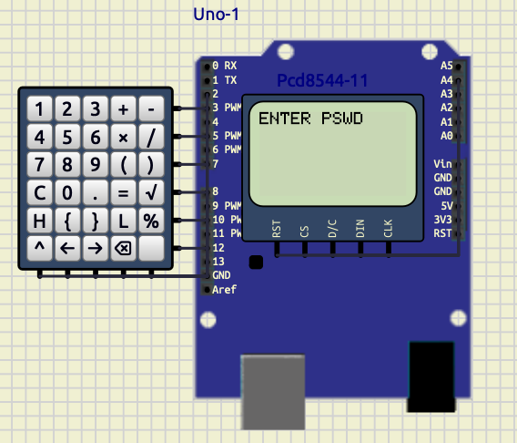

Description:  
This screenshot shows the password-protected lock mode. The calculator requests a password before access is granted.

---

### **4. Prefix Expression Display**

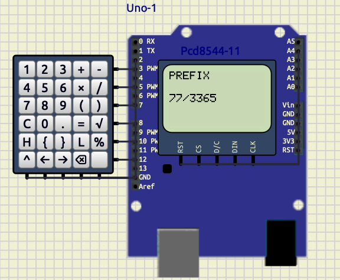

Description:  
This screenshot shows the generated prefix notation after converting the infix expression entered by the user.

---
## **Calculator Output**

The calculator successfully evaluates arithmetic expressions.

Example:

```text
78*54-6
```

Output:

```text
4206
```

---
## **History Navigation**

The history system stores and reloads previous expressions.

Stored expression example:

```text
86*55-(9/4)
```

---
## **Lock Screen**

Password protection system:

Screen displayed:

```text
ENTER PSWD
```

---
## **Prefix Conversion Display**

The calculator shows the generated prefix expression.

Example prefix output:

```text
-+7*3365
```

---
## **Conclusion**

The project successfully implemented a scientific calculator using Arduino UNO and PCD8544 display.

The system demonstrated:

- infix-to-prefix conversion
- prefix evaluation
- stack-based processing
- history management
- password protection
- cursor-based editing

The replacement of the OLED display with the PCD8544 LCD significantly improved system stability and memory efficiency.

The project integrates concepts from:

- embedded systems,
- data structures,
- compiler design,
- and user-interface engineering

into a compact and efficient hardware implementation.
Looking at your screenshots — sine and triangle look great, PWM just needs fixing. Here's the Exp 3 section to add directly to your report:

# Experiment 3 — Multi-Waveform Generator

## 1.Waveform Generator

### Objective

To design and implement a multi-waveform generator using Arduino Uno, an 8-bit R-2R DAC, a Nokia PCD8544 LCD display, push buttons, and a potentiometer. The system generates sine, triangle, and PWM waveforms selectable via dedicated push buttons, with frequency controlled by a potentiometer.

---

### Components Required

| Component | Quantity | Purpose |
|---|---|---|
| Arduino Uno | 1 | Main controller |
| Nokia PCD8544 LCD | 1 | Display waveform info |
| R-2R DAC (8-bit) | 1 | Analog wave output |
| Push Buttons | 3 | Wave selection (S/T/P) |
| Potentiometer (10 kΩ) | 1 | Frequency control |
| Resistor 220Ω | 1 | DAC output filter |
| Capacitor 10 µF | 1 | Signal smoothing |
| Connecting Wires | Multiple | Connections |

---

### Circuit Connections

| Component | Arduino Pin |
|---|---|
| DAC D0–D7 | D6–D13 |
| DAC OUT | Oscilloscope Channel 1 |
| PWM Output | D5 → Oscilloscope Channel 2 |
| Sine Button | D2 |
| Triangle Button | D3 |
| PWM Button | D4 |
| Potentiometer | A5 |
| LCD RST | A0 |
| LCD CS | A1 |
| LCD DC | A2 |
| LCD DIN | A3 |
| LCD CLK | A4 |

---

### Working Principle

The waveform generator operates three independent wave logics unified under a single non-blocking loop. The triangle wave logic increments and decrements an integer `value` by a fixed step of 8 between 0 and 255, writing each step to the 8-bit R-2R DAC on pins D6–D13 using bitwise shifting — this is the exact logic from the standalone triangle sketch. The sine wave logic advances a floating-point `angle` variable by 0.2 radians per step, computes `127 + 127 * sin(angle)`, and writes the result to the same DAC — identical to the standalone sine sketch. The PWM logic toggles pin D5 HIGH and LOW with a fixed 500 µs half-period, matching the original standalone PWM sketch exactly. Since sine and triangle are never active simultaneously — the push buttons ensure only one is selected at a time — both safely share the same DAC pins without conflict. The key integration technique is replacing each sketch's `delayMicroseconds()` with a `micros()`-based non-blocking timer, so the PWM toggle and the DAC output each check elapsed time independently without freezing one another. The potentiometer on A5 maps to the DAC update interval (controlling sine and triangle frequency), while PWM remains fixed at 1 kHz as in the original. The PCD8544 display refreshes every 300 ms showing the active waveform name, step size, amplitude, and output pin.

---

### Code

```cpp
#include <math.h>
#include <Adafruit_GFX.h>
#include <Adafruit_PCD8544.h>

Adafruit_PCD8544 display = Adafruit_PCD8544(A4, A3, A2, A1, A0);

int dacPins[8] = {6, 7, 8, 9, 10, 11, 12, 13};
int pwmPin = 5;

const int btnSine = 2;
const int btnTri  = 3;
const int btnPWM  = 4;
const int potPin  = A5;

char activeWave = 'S';

// original triangle state
int value     = 0;
int direction = 1;

// original sine state
float angle = 0;

// pwm state
bool pwmState = false;

unsigned long lastDac     = 0;
unsigned long lastPwm     = 0;
unsigned long lastDisplay = 0;

const unsigned long PWM_HALF = 5000; // 5ms each side → 100 Hz, visible on scope

unsigned long getDacDelay(int potVal) {
  return (unsigned long)map(potVal, 0, 1023, 50, 500);
}

void outputDAC(int number) {
  for (int i = 0; i < 8; i++) {
    digitalWrite(dacPins[i], (number >> i) & 1);
  }
}

void updateDisplay(char wave, int potVal) {
  display.clearDisplay();
  display.setTextSize(1);
  display.setTextColor(BLACK);

  display.setCursor(0, 0);
  switch (wave) {
    case 'S': display.print(F("Waveform: SINE")); break;
    case 'T': display.print(F("Waveform: TRI"));  break;
    case 'P': display.print(F("Waveform: PWM"));  break;
  }

  display.setCursor(0, 10);
  display.print(F("Pot: "));
  display.print(potVal);

  display.setCursor(0, 20);
  switch (wave) {
    case 'S':
    case 'T': display.print(F("Amp: 127 DAC")); break;
    case 'P': display.print(F("Duty: 50%"));    break;
  }

  display.setCursor(0, 30);
  switch (wave) {
    case 'S': display.print(F("Step: 0.2 rad")); break;
    case 'T': display.print(F("Step: 8"));       break;
    case 'P': display.print(F("Period: 1ms"));   break;
  }

  display.setCursor(0, 40);
  switch (wave) {
    case 'S':
    case 'T': display.print(F("Out: D6-D13 DAC")); break;
    case 'P': display.print(F("Out: D5"));          break;
  }

  display.display();
}

void setup() {
  for (int i = 0; i < 8; i++) pinMode(dacPins[i], OUTPUT);
  pinMode(pwmPin,  OUTPUT);
  pinMode(btnSine, INPUT_PULLUP);
  pinMode(btnTri,  INPUT_PULLUP);
  pinMode(btnPWM,  INPUT_PULLUP);

  display.begin();
  display.setContrast(57);
  display.clearDisplay();
  display.display();

  Serial.begin(9600);
  updateDisplay(activeWave, 512);
}

void loop() {
  unsigned long now = micros();
  int potVal        = analogRead(potPin);
  unsigned long dacDelay = getDacDelay(potVal);

  // Buttons
  if (digitalRead(btnSine) == LOW && activeWave != 'S') {
    activeWave = 'S'; angle = 0; delay(50);
  } else if (digitalRead(btnTri) == LOW && activeWave != 'T') {
    activeWave = 'T'; value = 0; direction = 1; delay(50);
  } else if (digitalRead(btnPWM) == LOW && activeWave != 'P') {
    activeWave = 'P'; outputDAC(0); pwmState = false; delay(50);
  }

  // PWM — fixed 5ms half period, independent of DAC
  if (now - lastPwm >= PWM_HALF) {
    lastPwm = now;
    if (activeWave == 'P') {
      pwmState = !pwmState;
      digitalWrite(pwmPin, pwmState ? HIGH : LOW);
    } else {
      digitalWrite(pwmPin, LOW);
    }
  }

  // DAC — sine or triangle, pot controls speed
  if (now - lastDac >= dacDelay) {
    lastDac = now;

    if (activeWave == 'S') {
      // exact original sine logic
      int sineValue = 127 + 127 * sin(angle);
      outputDAC(sineValue);
      angle += 0.2;
      if (angle >= 6.283) angle = 0;

    } else if (activeWave == 'T') {
      // exact original triangle logic
      outputDAC(value);
      value += direction * 8;
      if (value >= 255) { value = 255; direction = -1; }
      if (value <= 0)   { value = 0;   direction =  1; }
    }
  }

  // Display every 300ms
  if (millis() - lastDisplay >= 300) {
    lastDisplay = millis();
    updateDisplay(activeWave, potVal);
  }
}
```

---

### Screenshots

#### PWM Wave

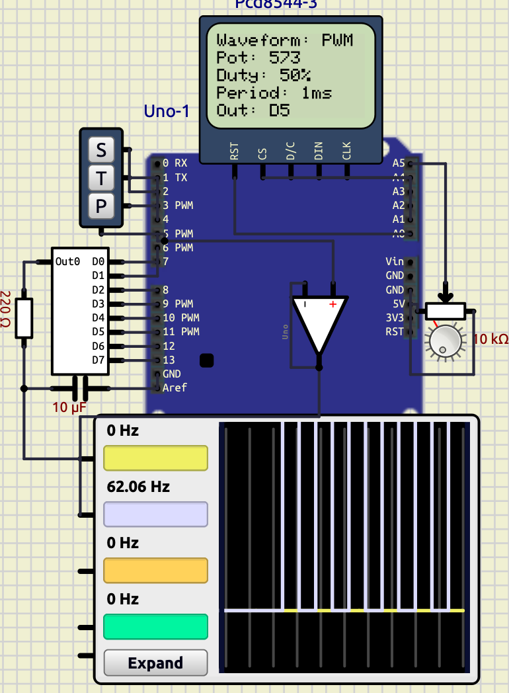

#### Sine Wave

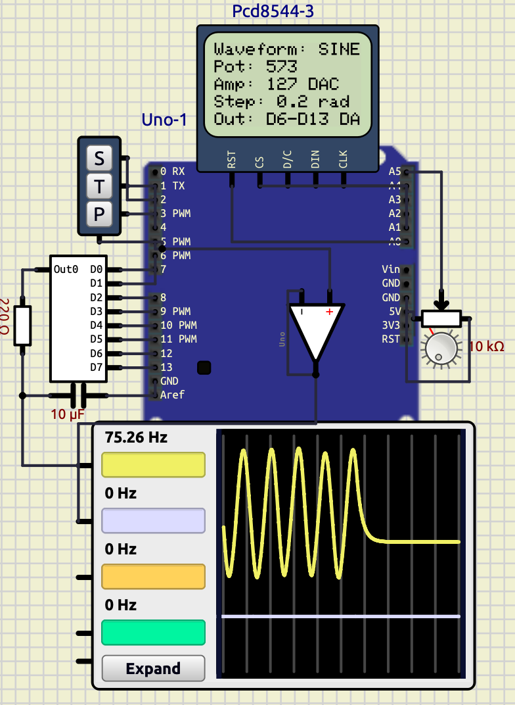

#### Triangle Wave

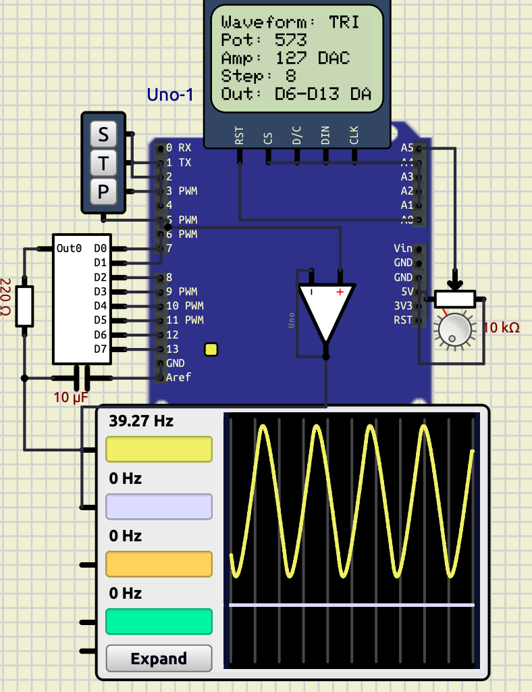

---

### Observations

| Waveform | Output Pin   | Frequency Control | Step Size | Amplitude      |
| -------- | ------------ | ----------------- | --------- | -------------- |
| Sine     | D6–D13 (DAC) | Potentiometer     | 0.2 rad   | 127 DAC counts |
| Triangle | D6–D13 (DAC) | Potentiometer     | 8 counts  | 127 DAC counts |
| PWM      | D5           | Fixed             | —         | 5V (digital)   |

---
## **Reference**

 Know about Embedded System, “DAC Digital to Analog Converter,” YouTube playlist available: https://youtube.com/playlist?list=PL64VXTyRJbOoH6Zn5ddF9vljSijatvazM.
  
---
### Conclusion

The experiment successfully demonstrated a multi-waveform generator using Arduino and an 8-bit R-2R DAC. All three waveforms — sine, triangle, and PWM — operated correctly and were clearly visible on the oscilloscope. The non-blocking `micros()` timing approach preserved the original wave mathematics from each standalone sketch while allowing all three to coexist in a single unified program. The potentiometer provided real-time frequency control for sine and triangle waves, and the Nokia PCD8544 display correctly reported waveform characteristics for each selected mode.

# <div id="exp4"></div>
# Experiment 4 — RTC-Based Smart Monitoring and Automation System

## **Objective**

The objective of this experiment was to interface the DS1307 Real Time Clock (RTC) module with Arduino Uno using the I2C communication protocol and display real-time clock data on a 16×2 LCD display. The project was further extended to implement alarm functionality, keypad-based time configuration, automatic motor control, and periodic temperature logging using a DS18B20 digital temperature sensor.  

---

## **Introduction**

Real Time Clock (RTC) modules are widely used in embedded systems where accurate timekeeping is required independently of the main controller operation. The DS1307 RTC module communicates with microcontrollers using the I2C bus and maintains time even during power interruptions through a backup battery.

In this experiment, the RTC module was interfaced with an Arduino Uno to create a fully functional real-time monitoring and automation system. The system was developed progressively in multiple stages:

- basic RTC clock display,
- keypad-based time and alarm setting,
- alarm buzzer system,
- automatic motor switching,
- and periodic temperature recording.

---

## **Components Required**

| **Component**              | **Purpose**                  |
| -------------------------- | ---------------------------- |
| Arduino Uno                | Main controller              |
| DS1307 RTC Module          | Real-time clock source       |
| 16×2 HD44780 LCD           | Time and status display      |
| Push Button Keypad         | User input and configuration |
| Buzzer                     | Alarm indication             |
| DC Motor                   | Water pump simulation        |
| DS18B20 Temperature Sensor | Ambient temperature sensing  |
| 4.7kΩ Resistor             | Pull-up resistor for DS18B20 |
| Connecting Wires           | Hardware interfacing         |
| Relay                      | Switching                    |
| Power supply               | Powering Motor               |
| Ground                     | Grounding                    |

---

## **Theory**

## **DS1307 RTC Module**

The DS1307 is a low-power Real Time Clock IC that communicates using the I2C protocol. It stores:

- seconds,
- minutes,
- hours,
- day,
- date,
- month,
- and year information.

The RTC maintains accurate time using an external crystal oscillator and battery backup.

The Arduino communicates with the RTC through:

- SDA (Serial Data Line)
- SCL (Serial Clock Line)

using the `Wire.h` library.

---

## **I2C Communication**

I2C is a synchronous serial communication protocol that uses only two wires:

- SDA → data transfer
- SCL → clock signal

The Arduino acts as the master device while the DS1307 acts as the slave device.

Advantages:

- minimal wiring,
- multiple device support,
- synchronized communication,
- reliable data transfer.

---

## **LCD Interfacing**

The 16×2 LCD was interfaced in 4-bit mode using the `LiquidCrystal` library. The LCD continuously displays:

- current time,
- temperature,
- motor state,
- and system modes.

---

## **Keypad Control System**

A 2×2 keypad arrangement was implemented using four push buttons.

### **Functional Buttons**

| **Button** | **Function**           |
| ---------- | ---------------------- |
| M          | Change mode            |
| +          | Increment values       |
| -          | Decrement values       |
| S          | Save configured values |

The keypad allows:

- time setting,
- alarm configuration,
- and mode navigation.

---

## **Temperature Logging**

The DS18B20 digital sensor was used for ambient temperature monitoring.

The sensor communicates using the OneWire protocol and periodically sends temperature values to the Arduino.

Temperature data is:

- displayed on the LCD,
- and logged to the Serial Monitor every 15 minutes.

---

## **Circuit Connections**

## **LCD Connections**

| **LCD Pin** | **Arduino Pin** |
| ----------- | --------------- |
| RS          | D7              |
| EN          | D6              |
| D4          | D5              |
| D5          | D4              |
| D6          | D3              |
| D7          | D2              |

---

## **RTC Connections**

| **RTC Pin** | **Arduino Pin** |
| ----------- | --------------- |
| SDA         | A4              |
| SCL         | A5              |
| SQW         | A0              |


---

## **Keypad Connections**

| **Keypad Pin** | **Arduino Pin** |
| -------------- | --------------- |
| Row 1          | D10             |
| Row 2          | D11             |
| Column 1       | D12             |
| Column 2       | D13             |

---

## **Additional Connections**

| **Component**       | **Arduino Pin** |
| ------------------- | --------------- |
| Buzzer              | D9              |
| Relay               | D8              |
| Water Supply Switch | A1              |
| DS18B20 Data        | A2              |

| Component    | Connection |
| ------------ | ---------- |
| Relay        | Motor      |
| Power Supply | Relay      |

---

## **Development and Code Progression**

The project was developed incrementally in three major stages.

---

### **Stage 1 — Basic RTC Clock and Alarm System**

The first implementation focused on RTC interfacing and user-controlled clock management.

## **Features Implemented**

- DS1307 RTC interfacing
- LCD clock display
- keypad scanning
- time configuration
- alarm setting
- buzzer activation

### **Main Functional Blocks**

|**Function**|**Purpose**|
|---|---|
|`readTime()`|Reads RTC registers|
|`setRTCTime()`|Writes updated time to RTC|
|`scanKeypad()`|Detects keypad inputs|
|`drawAll()`|Updates LCD contents|
|`incrementValue()`|Increases selected parameter|
|`decrementValue()`|Decreases selected parameter|

---

## **System Operation**

The RTC continuously sends current time information to the Arduino. The LCD displays:

```text
HH:MM:SS
```

The user can enter configuration mode using the keypad and modify:

- hour,
- minute,
- second,
- alarm hour,
- alarm minute.

When current time matches alarm time:

- the buzzer activates for 10 seconds.

---

## **Key Learning Outcomes**

This stage established:

- stable I2C communication,
- LCD interfacing,
- keypad matrix scanning,
- and RTC register handling.

Code progression reference:  

---

### **Stage 2 — Automatic Motor Control System**

The second stage transformed the RTC system into a simple automation controller.

---

## **Objective**

To automatically control a water pump based on water supply availability.

---

## **Functional Enhancements Added**

### **New Variables Introduced**

```cpp
bool motorState;
unsigned long motorStartTime;
unsigned long waterLostTime;
bool waterPreviouslyPresent;
```

### **New Function Added**

```cpp
void handlePumpControl()
```

---

## **Working Logic**

The water supply was simulated using a push-button input connected to pin A1.

### **Operating Conditions**

|**Water Condition**|**Motor Action**|
|---|---|
|Water available|Motor turns ON|
|Water unavailable|OFF timer starts|
|10 minutes elapsed|Motor turns OFF|

---

## **Automation Principle**

When water becomes available:

1. motor starts automatically,
2. runtime timer starts.

The motor turns OFF if:

- water supply disappears,
- or runtime exceeds 10 minutes.

---

## **System Improvements**

The LCD was modified to additionally display motor state:

```text
ON / OFF
```

Code progression reference:  

---

### **Stage 3 — Temperature Logging and Monitoring**

The final stage integrated environmental sensing and serial logging.

---

## **Objective**

To periodically record ambient temperature values for temperature prediction and monitoring purposes.  

---

## **Sensor Used**

Instead of LM35 mentioned in the experiment sheet, a DS18B20 digital temperature sensor was implemented due to:

- digital accuracy,
- easier interfacing,
- and OneWire communication support.

---

## **Additional Libraries Added**

```cpp
#include <OneWire.h>
#include <DallasTemperature.h>
```

---

## **New Functionalities Added**

- DS18B20 interfacing
- LCD temperature display
- serial temperature logging
- periodic sensor polling
- timestamped data recording

---

## **Logging Mechanism**

Temperature values were logged every:

```text
15 minutes
```

using RTC timestamps.

### **Sample Output**

```text
TIME: 00:15:00 TEMP: 23.00 C
```

---

## **Main Function Added**

```cpp
void handleTemperatureLogging()
```

---

## **Working Principle**

The Arduino continuously:

1. reads RTC time,
2. acquires sensor temperature,
3. updates LCD,
4. checks logging interval.

At every 15-minute boundary:

- data is transmitted through the Serial Monitor.

This stage integrated:

- RTC timing,
- sensor interfacing,
- serial communication,
- and periodic event scheduling.

Code progression was implemented incrementally through RTC interfacing, automation control, and temperature logging modules.

---

## **Problems Faced During Implementation**

Several practical issues were encountered during system development.

---

### **1. Internal Input Handling Issues**

### **Problem**

The keypad initially produced:

- unstable inputs,
- repeated key detections,
- accidental mode switching.

This made:

- time setting inconsistent,
- menu handling unreliable.

---

### **Cause**

Mechanical switch bouncing and rapid polling caused multiple detections for a single press.

---

### **Solution**

Software debouncing was implemented using:

```cpp
delay(40);
```

along with key release detection:

```cpp
while(scanKeypad()==k);
```

This stabilized keypad operation significantly.

---

### **2. Mode Switching and Time Setting Errors**

### **Problem**

While changing modes:

- LCD values updated,
- but RTC values sometimes failed to synchronize correctly.

---

### **Cause**

The local variables and RTC registers were not refreshed immediately after writing updated time.

---

### **Solution**

After saving:

1. RTC values were re-read,
2. display variables refreshed,
3. mode reset correctly.

This resolved synchronization inconsistencies.

---

### **3. Motor Turning OFF Too Quickly**

### **Problem**

Initially the motor turned OFF almost immediately after switching ON.

---

### **Cause**

Incorrect timer values were used:

```cpp
10000 ms
```

which corresponds to:

```text
10 seconds
```

instead of the intended longer runtime.

---

### **Solution**

Timer values were modified to:

```cpp
600000 ms
```

which corresponds to:

```text
10 minutes
```

The motor then operated correctly.

---

### **4. Temperature Reading Showing −127°C**

### **Problem**

The DS18B20 sensor initially displayed:

```text
-127°C
```

instead of actual temperature values.

---

### **Cause**

This occurred due to:

- improper wiring,
- missing pull-up resistor,
- unstable data line communication.

---

### **Solution**

A 4.7kΩ pull-up resistor was connected between:

- DATA pin,
- and +5V.

After correction:

- proper temperature readings were obtained.

---

## **Screenshot**

Final integrated system:
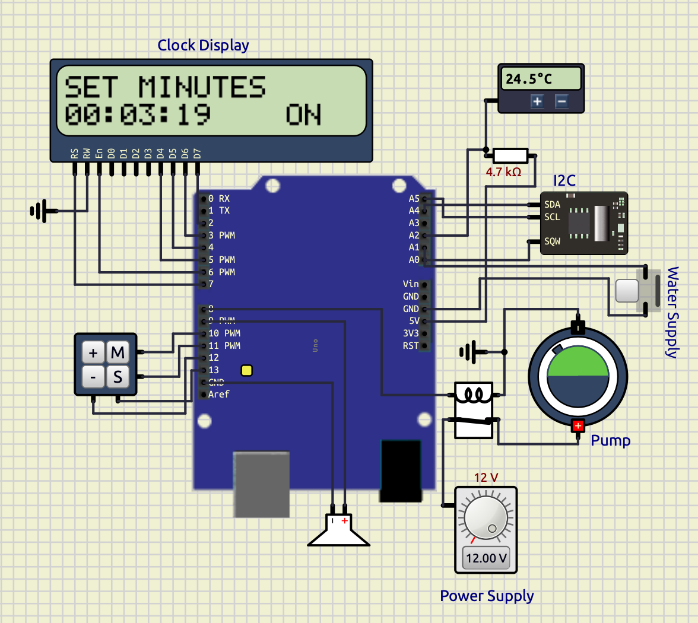


---

## **Observations**

|**System Module**|**Observation**|
|---|---|
|RTC Module|Accurate timekeeping achieved|
|LCD Display|Stable real-time updates|
|Keypad System|Proper mode control achieved|
|Alarm System|Successful buzzer activation|
|Motor Automation|Correct timed switching observed|
|Temperature Logging|Stable periodic logging achieved|

---

## **Time Drift**

Time drift refers to the gradual deviation of RTC time from actual real-world time due to oscillator inaccuracies.

In the DS1307 RTC:

- small drift occurs over long durations,
- mainly due to crystal oscillator tolerances,
- temperature variation,
- and power stability.
---

---

## Final Remarks

Across these experiments, the focus gradually shifted from simple digital I/O operations to complete embedded systems integrating sensors, displays, communication protocols, automation logic, and real-time data processing. Together, the projects demonstrate practical application of electronics, programming, data structures, and system design concepts using the Arduino ecosystem.

## **Conclusion**

The experiment successfully demonstrated implementation of a real-time embedded monitoring and automation system using the I2C protocol and DS1307 RTC module.

The project progressively evolved from:

- a basic RTC clock,  
    to
- an alarm system,
- motor automation controller,
- and finally a temperature logging platform.

The experiment verified practical implementation of:

- I2C communication,
- RTC interfacing,
- LCD interfacing,
- keypad scanning,
- embedded automation,
- serial communication,
- and sensor-based monitoring systems.

The final system demonstrated modular embedded system design and real-world integration of multiple peripherals into a unified intelligent monitoring platform.